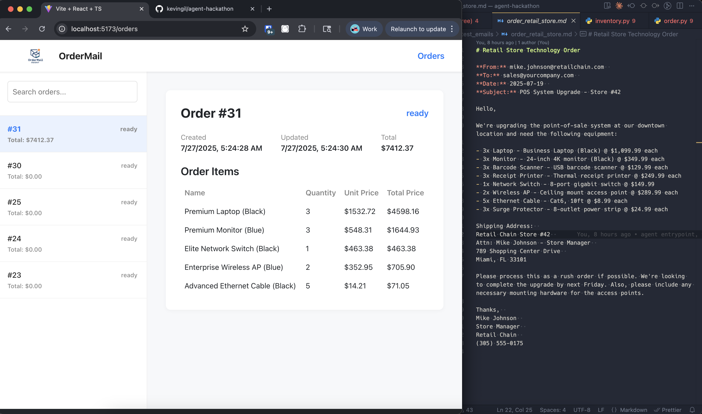

# OrderMail AI

This project features an agentic workflow for automated order processing from natural language emails. The system uses a combination of LLMs (OpenAI GPT), a tool orchestration framework, and a backend service to extract, match, and process orders end-to-end.

## Tech Stack
- Python (asyncio, Flask, SQLAlchemy)
- OpenAI (LLM extraction and reasoning)
- Agentic orchestration (custom OrchestratorAgent)
- MCP tool server for inventory/order actions
- PostgreSQL database

## Key Features
- Reads and parses order emails in natural language
- Uses LLM to extract structured order items
- Agent orchestrates tool calls: create order, add items, fuzzy search, finalize
- Robust fallback logic for item matching
- Summarizes actions and order status

## Main Commands (from backend/Makefile)
- `make install` — Install backend dependencies
- `make run` — Start the Flask backend
- `make mcp` — Start the MCP tool server
- `make agent` — Run the agent workflow to process test emails

